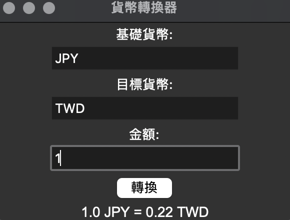

# 貨幣轉換器

這是一個簡單的貨幣轉換器，使用 ExchangeRate-API 來實現貨幣轉換功能。

## 功能
- 用戶可以輸入基礎貨幣代碼（例如：USD, TWD）和目標貨幣代碼（例如：JPY, EUR）來進行貨幣轉換。
- 支援即時匯率查詢。
- 提供簡單直觀的介面來進行貨幣轉換。

## 安裝
1. clone或下載此專案

2. 創建並啟動虛擬環境：
   python3 -m venv venv

4. 安裝所需的依賴：
   pip install -r requirements.txt

## 設定 API Key
訪問 ExchangeRate-API 官方網站。

註冊一個免費帳戶。

登入後，複製你的 API Key。

設置 .env 檔案
在專案根目錄下建立一個 .env 檔案，並加入以下內容：
API_KEY=你的_API_KEY

## 使用方法
1. 執行程式：
   python3 converter.py

3. 在介面上選擇你要轉換的貨幣和金額，按下「轉換」即可顯示結果。

## 截圖

